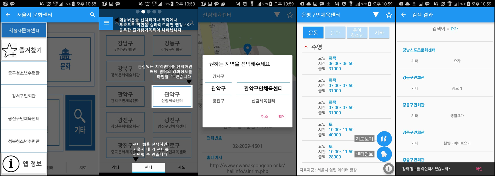

## SeoulCultureCenter

# 서울시 문화센터

- 서울시내에 위치한 문화센터 및 생활체육센터를 소개해주는 앱입니다. 해당 센터의 개설 강좌, 수강료, 날짜, 시간 등을 소개해주며, 위치기반으로 정보를 제공합니다.    
[2016 함께서울 공모전 장려상](https://mplatform.seoul.go.kr/w/contest/award/2016/wnpz/selectWinner.do)

- Naver 지도 API, CSV parser, Fragment, ViewPager, CollapsingToolbarLayout, FloatingActionButton, SearchView   

- 스크린 화면

- 동영상  

- 다운로드  
[구글 플레이스토어](https://play.google.com/store/apps/details?id=com.seoul.culture)

